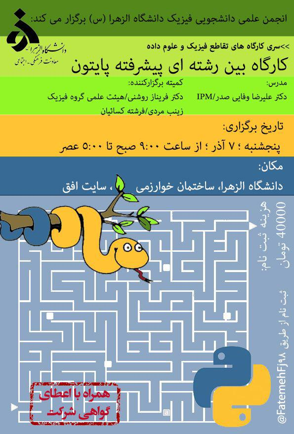

# Alzahra Workshop 2019

This repository contains the material of Alzahra university interdisciplinary Python workshop.

    
    

### The requirements

  1. **Linux** is always as recommended as OS! 

  2. **Anaconda** as python package manager is also recommended. 
  You can find it [HERE](https://anaconda.org/ "Anaconda website").
  
  3. **Jupyter Notebook** will be used as development environment.
 
